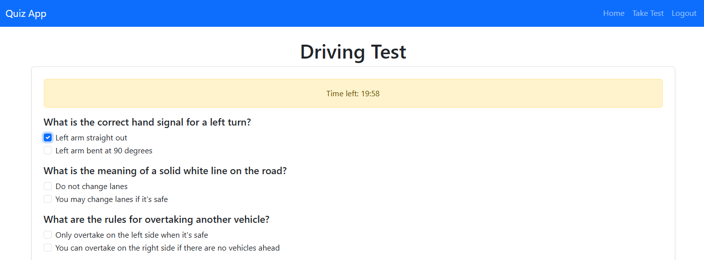

# Driving Test Application




This is a Django-based application for a driving test quiz.

## Features

- User authentication (login required).
- Randomized test questions (20 per test).
- Timer for the test (20 minutes).
- Scoring and result tracking.

## Setup Instructions

1. Create a virtual environment and activate it:
   ```
   python -m venv venv
   source venv/bin/activate
   ```

2. Install dependencies:
   ```
   pip install django
   ```

3. Run migrations:
   ```
   python manage.py makemigrations
   python manage.py migrate
   ```

4. Start the development server:
   ```
   python manage.py runserver
   ```

5. Access the application at `http://127.0.0.1:8000/`.
        